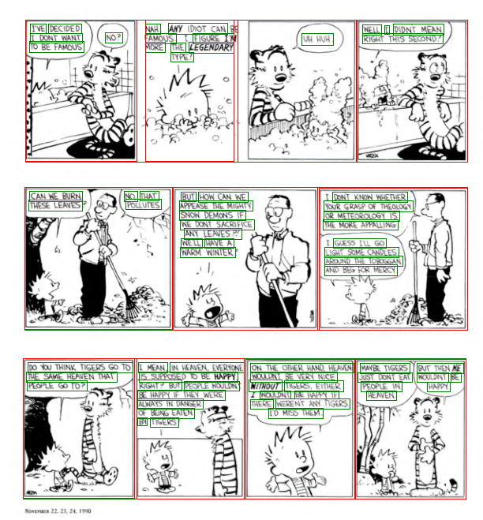

# Calvin and Hobbes Text Density

    

What's the distribution of (text_area/panel_area) for Calvin and Hobbes strips?

## Method

*The Complete Calvin and Hobbes* is available for free [here](https://ia600903.us.archive.org/20/items/TheCompleteCalvinHobbes_201902/The%20Complete%20Calvin%20%26%20Hobbes_text.pdf). With edge detection to find panel borders, structural observations to segment panels into strips, and OCR to extract text bounding boxes, we can annotate each page fairly accurately:

    

## Results

All panels, not segregated by strip:

Strips:

Normal distributions rule everything around me.
